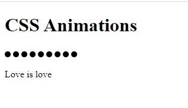

# Animated heart 

Today we will play around with CSS animations to build an animated heart. 
We found this amazing animation on [Codepen](https://codepen.io/yumeeeei/pen/BQPmpX).

## Setup and connect all the files

We create a very simple HTML file `index.html` and a CSS file `styles.css`. The `index.html` is the entrypoint of any website. 
In this file we need to specify all other files that the webiste needs as well - in our case the `styles.css`. 

```html
<!DOCTYPE html>
<html lang="en">
  <head>
    <meta charset="UTF-8" />
    <meta name="viewport" content="width=device-width, initial-scale=1.0" />
    <meta http-equiv="X-UA-Compatible" content="ie=edge" />
    <link rel="stylesheet" href="styles.css" type="text/css" />
    <title>CSS Animations</title>
  </head>
  <body>
    <h1>CSS Animations</h1>
  </body>
</html>
```

In order to check that our styles file is loaded correctly, we will add a styling for the body to the css file `body { font-family: Verdana, Geneva, Tahoma, sans-serif; }`. When we now see the font change on the website we've done everything correctly. 

## Basic HTML structure - Showing 9 dots 

Our heart consists of nine animated vertical lines and below the heart we have some text. 
Our basic markup will consi

```html
<body>
    <h1>CSS Animations</h1>
    <div class="heart-container">
      <div class="heart">
        <span class="heart-piece"></span>
        <span class="heart-piece"></span>
        <span class="heart-piece"></span>
        <span class="heart-piece"></span>
        <span class="heart-piece"></span>
        <span class="heart-piece"></span>
        <span class="heart-piece"></span>
        <span class="heart-piece"></span>
        <span class="heart-piece"></span>
      </div>
      <p>
        Love is love
      </p>  
    </div>
</body>
```

💡 `span` is an inline HTML element, which means that it will only take as much space as it requires and will not result in a new line. Which also means an empty span takes up no space at all and might not even be rendered. We will not see our nine heart pieces for now until we add some styling. 

Our animation starts off with 9 round dots, we will add some CSS styling to get that look. 
We will specify a size of 10 x 10 px for each of our heart-pieces and set the border-radius to half of the size to reach the circle shape. We also need to set a background color, for now black, to see the shape.

```css
.heart-piece {
  width: 10px;
  height: 10px;
  border-radius: 5px;
  background-color: black;
}
```

⚠️ If we add these changes we won't see anything because a `span` is an inline element and will not take up any space if it has no content. We need to set the display style to `inline-block` in order for our height and width property to be considered. 

```css
.heart-piece {
  display: inline-block;
}
```

Our first version should look like this: 



### Picking and setting colors 

Feel free to choose any colors you want. I will go for a rainbow color schema. 

```css
.heart-piece:nth-of-type(6n + 0) {
  background-color: #ec2d73;
}

.heart-piece:nth-of-type(6n + 1)  {
  background-color: #eb5324;
}

.heart-piece:nth-of-type(6n + 2)  {
  background-color: #fdc800;
}

.heart-piece:nth-of-type(6n + 3)  {
  background-color: #47b264;
}

.heart-piece:nth-of-type(6n + 4)  {
  background-color: #76469a;
}

.heart-piece:nth-of-type(6n + 5)  {
  background-color: #1470bd;
}
```

💡 `nth-of-type` is a selector that matches the nth element of the previously specified selector. It can receive a number, e.g. nth-of-type(3) would match the third element only. 
You could also specify the keywords `even` or `odd` to match every other element (great for table row coloring ;)). 

### Letting the dots grow 

The first part of our animation that we will do is the growing into a line. 
The shape is mirrored which means that the first and last piece have the same animation, the second and second-to last and so forth. 
With the `animation` property we can specify an animation, a duration and whether or not it loops - in our case one cycle will last 3.2 seconds and it will loop endlessly.

In the animation itself we specify css properties at certain stages of one animation cycle. At 0, 10, 90 and 100 percent we will have a height of 10 px, which is our original and at 45 and 55 we will have a height of 30 px. 

```css
.heart-piece:nth-of-type(1),
.heart-piece:nth-of-type(9) {
  animation: piece-0 3.2s infinite;
}

@keyframes piece-0 {
  0%,
  10%,
  90%,
  100% {
    height: 10px;
  }
  45%,
  55% {
    height: 30px;
  }
}
```

We will do that for each of our pairs of dots/lines. 

```css
.heart-piece:nth-of-type(2),
.heart-piece:nth-of-type(8) {
  animation: piece-1 3.2s infinite;
}

@keyframes piece-1 {
  0%,
  10%,
  90%,
  100% {
    height: 10px;
  }
  45%,
  55% {
    height: 60px;
  }
}

.heart-piece:nth-of-type(3),
.heart-piece:nth-of-type(7) {
  animation: piece-2 3.2s infinite;
}

@keyframes piece-2 {
  0%,
  10%,
  90%,
  100% {
    height: 10px;
  }
  45%,
  55% {
    height: 80px;
  }
}

.heart-piece:nth-of-type(4),
.heart-piece:nth-of-type(6) {
  animation: piece-3 3.2s infinite;
}

@keyframes piece-3 {
  0%,
  10%,
  90%,
  100% {
    height: 10px;
  }
  45%,
  55% {
    height: 90px;
  }
}

.heart-piece:nth-of-type(5) {
  animation: piece-4 3.2s infinite;
}

@keyframes piece-4 {
  0%,
  10%,
  90%,
  100% {
    height: 10px;
  }
  45%,
  55% {
    height: 94px;
  }
}
```

At this point our colored lines grow and shrink as specified. 

### Adding the delay

If we take a look at the original animation, the lines don't grow simulataneously but in a sequential fashion. 
We can get that effect by using an animation delay - we'll add 0.15 seconds to the second dot, twice as much to the thrid dot, three times the delay to the fourth dot and so on and so forth.

```css
.heart-piece:nth-of-type(2) {
  animation-delay: 0.15s;
}

.heart-piece:nth-of-type(3) {
  animation-delay: 0.3s;
}

.heart-piece:nth-of-type(4) {
  animation-delay: 0.45s;
}

.heart-piece:nth-of-type(5) {
  animation-delay: 0.6s;
}

.heart-piece:nth-of-type(6) {
  animation-delay: 0.75s;
}

.heart-piece:nth-of-type(7) {
  animation-delay: 0.9s;
}

.heart-piece:nth-of-type(8) {
  animation-delay: 1.05s;
}

.heart-piece:nth-of-type(9) {
  animation-delay: 1.2s;
}

```

After we've added this code we should see our lines growing and shrinking sequentially somewhat in sync. 

### Positioning in a heart shape 

The last missing piece is positioning the lines in a way that they represent this heart shape. 
In order to properly place our heart we will use absolute positioning. 

By changing the `position` attribute to `absolute` we can use the `left`/`right`/`top`/`bottom` properties to place the item explicitly inside its parent. 
we will use Flexbox to display our three items below each other. 

```css
.heart-container {
  text-align: center;
  display: flex;
  flex-direction: column;
  align-items: center;
}

.heart {
  margin-top: 50px;
  position: relative;
  width: 138px;
}

.heart-piece {
  position: absolute;
  top: -5px;
}
```

After this change all of our heart-pieces will be at the same spot. In order to fix that we will set the left property for each heart-piece individually. 

```css
.heart-piece:nth-of-type(1) {
  left: 0px;
}

.heart-piece:nth-of-type(2) {
  left: 16px;
}

.heart-piece:nth-of-type(3) {
  left: 32px;
}

.heart-piece:nth-of-type(4) {
  left: 48px;
}

.heart-piece:nth-of-type(5) {
  left: 64px;
}

.heart-piece:nth-of-type(6) {
  left: 80px;
}

.heart-piece:nth-of-type(7) {
  left: 96px;
}

.heart-piece:nth-of-type(8) {
  left: 112px;
}

.heart-piece:nth-of-type(9) {
  left: 128px;
}
```

Afterwards we have to adjust our animation to properly result in this heart shape. 

```css
@keyframes piece-0 {
  0%,
  10%,
  90%,
  100% {
    height: 10px;
    top: -5px;
  }
  45%,
  55% {
    height: 30px;
    top: -15px;
  }
}

@keyframes piece-1 {
  0%,
  10%,
  90%,
  100% {
    height: 10px;
    top: -5px;
  }
  45%,
  55% {
    height: 60px;
    top: -31px;
  }
}

@keyframes piece-2 {
  0%,
  10%,
  90%,
  100% {
    height: 10px;
    top: -5px;
  }
  45%,
  55% {
    height: 80px;
    top: -37px;
  }
}

@keyframes piece-3 {
  0%,
  10%,
  90%,
  100% {
    height: 10px;
    top: -5px;
  }
  45%,
  55% {
    height: 90px;
    top: -31px;
  }
}

@keyframes piece-4 {
  0%,
  10%,
  90%,
  100% {
    height: 10px;
    top: -5px;
  }
  45%,
  55% {
    height: 94px;
    top: -23px;
  }
}

```

Now we're done and our animation should work out properly 🎉