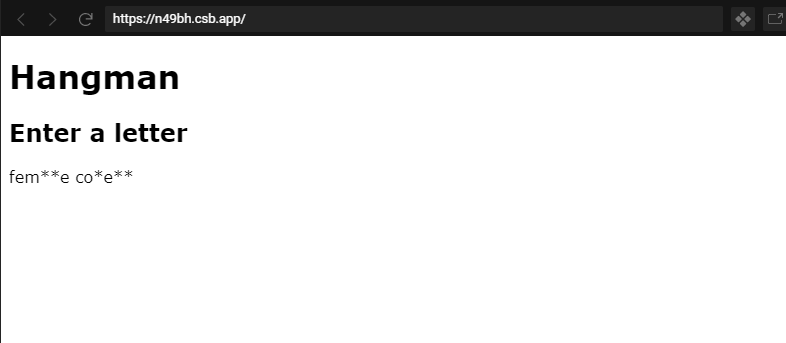

# Hangman 

## Setup and connect all the files

We create a very simple HTML file `index.html`, a CSS file `styles.css` and a JavaScript file `main.js`. The `index.html` is the entrypoint of any website. 
In this file we need to specify all other files that the webiste needs as well - our `styles.css` and the `main.js`. 

```html
<!DOCTYPE html>
<html lang="en">
  <head>
    <meta charset="UTF-8" />
    <meta name="viewport" content="width=device-width, initial-scale=1.0" />
    <meta http-equiv="X-UA-Compatible" content="ie=edge" />
    <link rel="stylesheet" href="styles.css" type="text/css" />
    <title>Hangman</title>
  </head>
  <body>
    <h1>Hangman</h1>

    <script type="text/javascript" src="hangman.js"></script>
  </body>
</html>
```

In order to check that our two files are loaded correctly, we will add a simple line `alert('Hello Hangman');` in the `main.js` file and a styling for the body to the css file `body { font-family: Verdana, Geneva, Tahoma, sans-serif; }`. When we now see the font change on the website and get a pop up we've done everything correctly. 

## Choosing a word and displaying it

In our Hangman game one person has to choose a word and enter it, and display as many blank lines as we have letters. We will do this by prompting the user with an input and saving the entered text in a variable. 
A variable is a container in which we can store values. 

```javascript
let word = prompt("Enter your chosen word please:");
console.log(word);
```

Next we want to display blank lines * for every character in our word - later on those lines will be replaced by the correctly guessed letters. In order for that we need to manipulate the HTML from the javascript. 🤯 
That's called DOM-manipulation, first we need to add a section in our HTML to specify where the text will be rendered. 

Let's add the following code in our body tag:
```html 
    <h1>Hangman</h1>
    <section>
      <h2>Enter a letter</h2>
      <p name="word-display"></p>
    </section>
```

Now we can grab that paragraph element and overwrite it's content to display our word in that HTML tag. 

```javascript
let word = prompt("Enter your chosen word please:");
showWord(word);

function showWord(hiddenWord) {
  let word = hiddenWord.replace(/[a-z]/gi, "*");

  document.getElementById("word").innerText = word;
}
```

💡 `/[a-z]/gi` is a regulare expression - it matches any number of letters from a to z in the whole String `hiddenword` - the g is for global and the i is for insensitive, which means it won't only match a-z but also A-Z. 

## Reacting to guesses and displaying letters 

Next up we need to react to guesses. Another player can enter a guess by just clicking a key on the keyboard. The browser will send an event whenever a key is pressed and we can easily react to that event and execute some code when we receive it by using an event listener. 

```javascript
document.onkeyup = function(event) {
	checkLetter(event.key);
};

function checkLetter(letter) {
    // TODO 
}
```

We need to keep in mind which letters were already guessed because those letters need to be displayed in our chosen word correctly.

```javascript
let guessedLetters = [];

function checkLetter(letter) {
  if (guessedLetters.includes(letter)) {
    // nothing to do this letter was already guessed
  } else {
    // add the ltter to our list
    guessedLetters.push(letter.toLowerCase());
  }
}
```

So far so good, we keep the guessed letters in an array now we have to check if any of the guessed letters match any letters in our word and display the letters we already guessed instead of the placeholder * symbols. We'll change and reverse our previous `showWord` logic a bit to the following:

```javascript
function showWord(hiddenWord) {
  var word = hiddenWord;

  for (var i = 0; i < hiddenWord.length; i++) {
    if (!guessedLetters.includes(hiddenWord[i].toLowerCase()) && hiddenWord[i] !== ' ') {
      word = word.replace(hiddenWord[i], "*");
    }
  }

  document.getElementById("word").innerText = word;
}
```

Now we can already guess letters and they will be shown properly instead of the placeholder symbol. It should already work fine for upper and lowercase letters.



## Counting wrong guesses

The next thing we need to do is to make our game more interesting and count our wrong guesses. We will need a counter, which we will set to 0 at the start of the game. On each wrong guess that we did not already guess before we will increase that counter by 1.

```javascript
var wrongGuesses = 0;

function checkLetter(letter) {
  if (guessedLetters.includes(letter)) {
    // nothing to do this letter was already guessed
  } else {
    // add the ltter to our list
    guessedLetters.push(letter.toLowerCase());
    if (!word.toLowerCase().includes(letter.toLowerCase())) {
      wrongGuesses++;
      console.log(`Number of wrong guesses ${wrongGuesses}`)
    }
  }
}
```

💡 Difference between `var` and `let`. The var and let keywords are used to declare variables, they have an important difference though! Variables declared with the `let` keyword can never be reassigned, whereas variables declared with the `var` keyword can be assigned a new value any time with the assignment operator =. 

💡 `wrongGuesses++` is shorthand for `wrongGuesses = wrongGuesses + 1` and therefore is only possible with variables declared via `var` and not `let`.  

## Hanging the man 

The last thing that's left for us to do is to actually draw the Hangman! We will use scalable vector graphics for that - or in short SVGs and in concrete the library [snapsvg](http://snapsvg.io/docs/).  
In order for us to be able to use that library we have to reference it in our `index.html` file. 

```html
<body>
    <section>
		<svg id="hangman" width="400" height="500"></svg>
    </section>
    
    <script
      type="text/javascript"
      src="https://cdnjs.cloudflare.com/ajax/libs/snap.svg/0.4.1/snap.svg-min.js"
    ></script>
    <script type="text/javascript" src="hangman.js"></script>
</body>
```

Depending on the number of wrong guesses we currently have we have to draw another line in our SVG. In order for our SVG library to work we need to attach it to a tag in our HTML document. Then we can use easy functions to draw lines, rectangles and circles. 

```javascript
let svg = Snap("#hangman");

function drawHangman(wrongGuesses) {
  if (wrongGuesses === 1) {
    svg.line(50, 450, 150, 450);
  } else if (wrongGuesses === 2) {
      // ...
  }
}

```

Whenever the `wrongGuesses` value changes we need to call this `drawHangman` logic. 
Now we need to add the other lines needed for our hangman according to this graphic:


```javascript
function drawHangman(wrongGuesses) {
  if (wrongGuesses === 1) {
    svg.line(50, 450, 150, 450);
  } else if (wrongGuesses === 2) {
    svg.line(100, 450, 100, 100);
  } else if (wrongGuesses === 3) {
    svg.line(100, 100, 300, 100);
  } else if (wrongGuesses === 4) {
    svg.line(300, 100, 300, 150);
  } else if (wrongGuesses === 5) {
    svg.circle(300, 175, 25);
  } else if (wrongGuesses === 6) {
    svg.line(300, 200, 300, 300);
  } else if (wrongGuesses === 7) {
    svg.line(300, 250, 250, 210);
  } else if (wrongGuesses === 8) {
    svg.line(300, 250, 350, 210);
  } else if (wrongGuesses === 9) {
    svg.line(300, 300, 250, 350);
  } else if (wrongGuesses === 10) {
    svg.line(300, 300, 350, 350);
  }
}
```